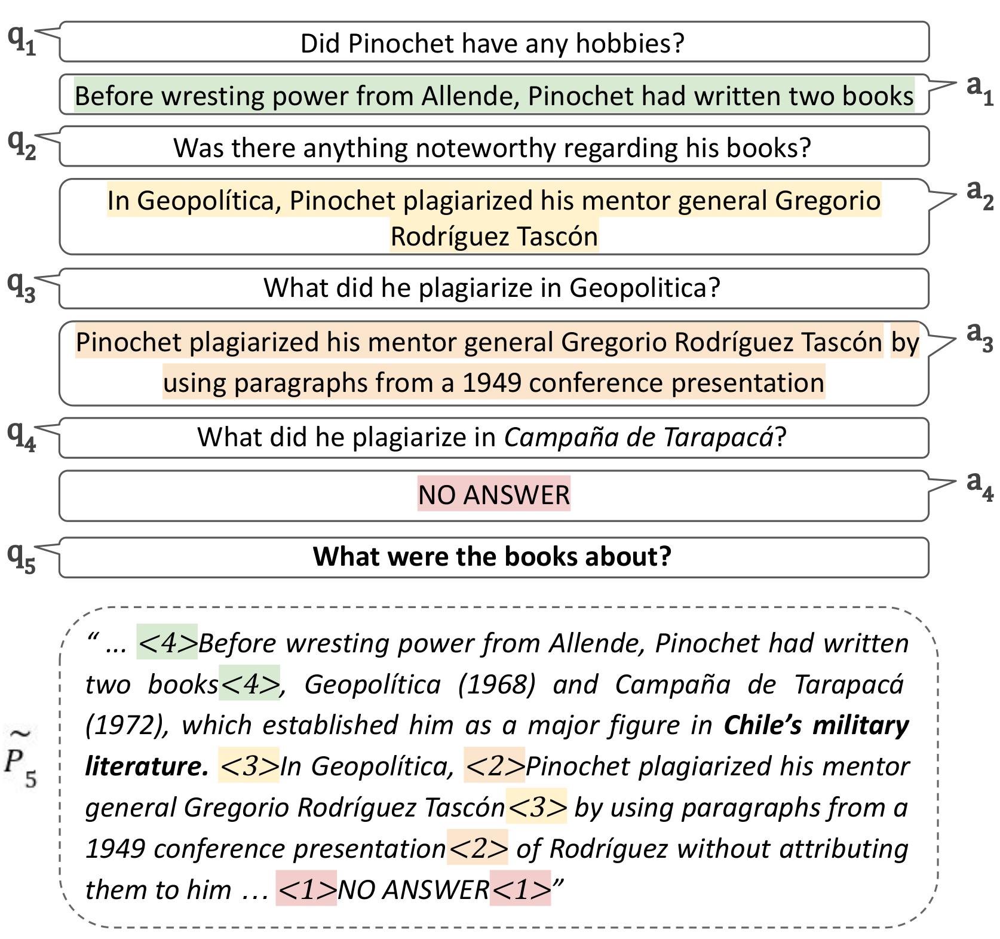

# MarCQAp
Official repository for the paper [On the Robustness of Dialogue History Representation in Conversational Question Answering: A Comprehensive Study and a New Prompt-based Method](https://arxiv.org/abs/2206.14796#) (to be published in TACL during 2023).

The code and data will be uploaded upon publication.

<div align="center">
  
</div>

Motivated by the findings in our paper, we propose **MarCQAp**, a novel prompt-based CQA approach that highlights answers from previous conversation turns, by inserting textual prompts in their respective positions within the reference document (see example in the Figure above). For more details please refer to Section 5 of the paper.

Results from our submission of **MarCQAp** to the official [QuAC Leaderboard](https://quac.ai/):

| QuAC Data Set | F1 | Predictions |
----------------|----|-------------|
| (Hidden) Test Set | [74.0](https://quac.ai/) | - |
| Validation Set | [74.6](https://worksheets.codalab.org/rest/bundles/0x704d89c8abab4c5983a15730cc59e7a6/contents/blob/stdout) | [pred.json](https://worksheets.codalab.org/rest/bundles/0x6fc6f9eb0ced4a489a168fc84a0c0413/contents/blob/pred.json) |

### Citation
If you find this useful for your work, please use the following citation:

```bibtex
@misc{2206.14796,
  Author = {Gekhman, Zorik and Oved, Nadav and Keller, Orgad and Szpektor, Idan and Reichart, Roi},
  Title = {On the Robustness of Dialogue History Representation in Conversational Question Answering: A Comprehensive Study and a New Prompt-based Method},
  Year = {2022},
  URL = {https://arxiv.org/abs/2206.14796},
  Eprint = {arXiv:2206.14796},
  Copyright = {Creative Commons Attribution 4.0 International}
}
```
